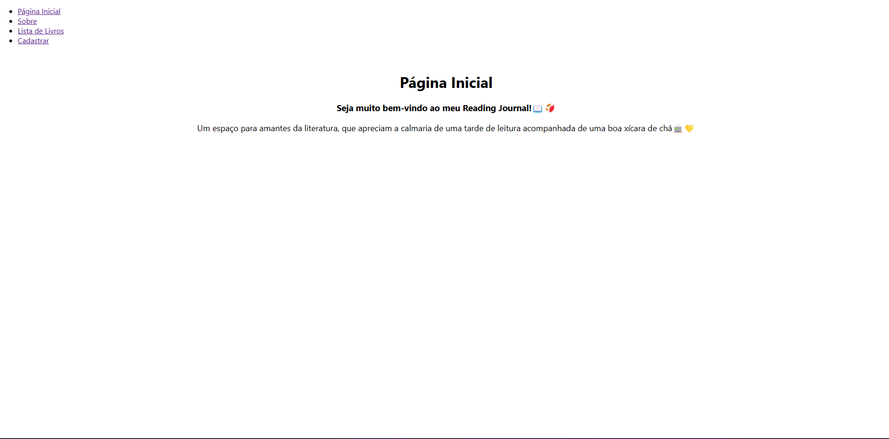

# Nome: `Nicole Saenger Soares`

## Projeto Fase 1 - CRUD para Reading Journal📚 

Este projeto é um CRUD (Create, Read, Update, Delete) de livros desenvolvido com React.js para a disciplina de Desenvolvimento de Sistemas Frontend. 

<br>
<br>

### 🚀 Neste projeto, você encontrará as seguintes funcionalidades:

- 📌 Adicionar Livro: Insira um novo livro a listagem informando o título, autor, gênero e data de publicação do livro desejado.

- 📋 Listagem de Livros: Exibe uma lista dos livros cadastrados.

- ✏️ Editar Livro: Permite modificar as informações previamente cadastradas em relação ao livro.

- ❌ Excluir Livro: Remove o livro desejado da lista.

<br>
<br>

### 🛠️ Para o desenvolvimento do CRUD, utilizei as seguintes tecnologias:

- React.js - Biblioteca principal para a interface do usuário.

- JavaScript - Utilizado para a lógica do CRUD.

- CSS - Para estilização da aplicação.

<br>
<br>

### 📥 Para executar este projeto, siga o seguinte passo a passo:
1. Acesse o diretório do projeto no terminal:
```
cd journal
```

2. Rode npm install para instalar as dependências do projeto:
```
npm install
```

3. Após, execute o projeto:
```
npm start
```

Atenção! O projeto será executado em http://localhost:3000.

<br>

Após execução do projeto, este é o resultado esperado no navegador:


<br>
<br>

### 🧩 Foram desenvolvidos os seguintes componentes:
#### BookForm
- Adiciona novos livros através da função addBook.
- Apresenta formulário para que o usuário possa adicionar as informações sobre o livro que deseja incluir.
- Adiciona o livro e reseta a página para incluir o próximo.

#### BookList
- Apresenta lista de livros cadatrados ao usuário.
- Com as funções deleteBook e editBook permite que os livros da lista sejam excluídos e editados.
- Apresenta função EditableField que torna os campos com as informações dos livros editáveis.
  
#### NavBar
- Usando a função Link da biblioteca 'react-router-dom' possibilita a navegação entre as páginas.
- Monta o menu de navegação.

<br>
<br>

### 📄 O CRUD desenvolvido apresenta as seguintes páginas:
#### Home
- Página inicial, contendo uma breve apresentação ao usuário.

#### Info
- Contém as informações sobre o pojeto, trazendo uma contextualização.

#### BookList
- Apresenta a lista de livros com as opções de edição e exclusão.

#### BookForm
- Posisbilita a inclusão de novos livros a listagem.


---
<br>
📜 Projeto autoral desenvolvido para a disciplina de Desenvolvimento de Sistemas Frontend da universidade PUCRS.
