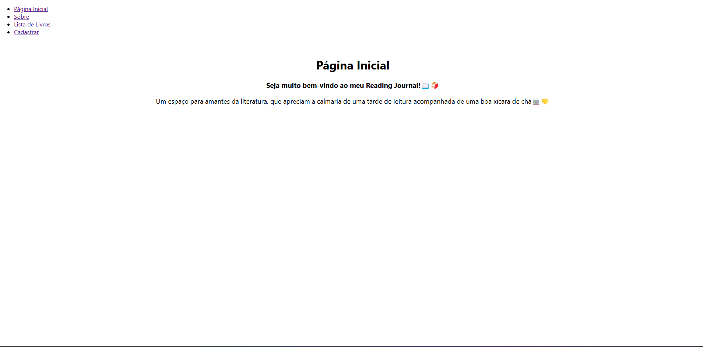
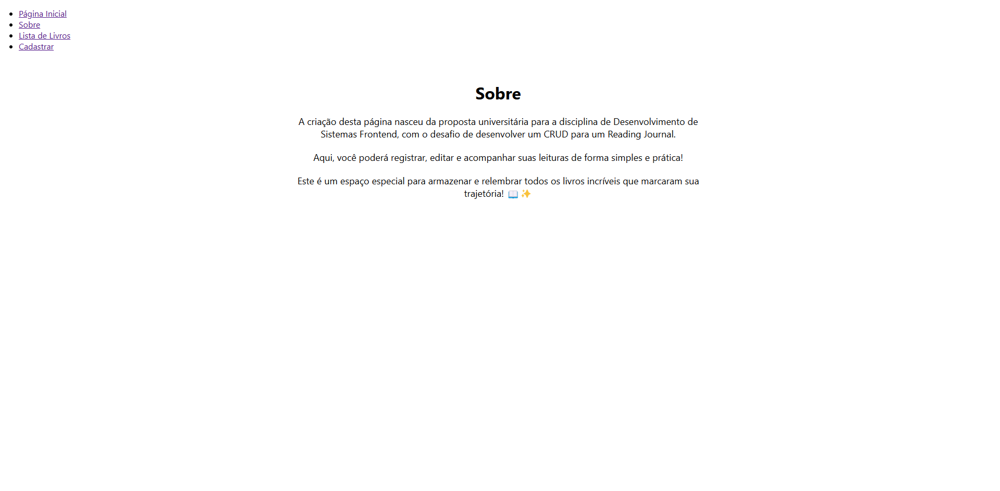
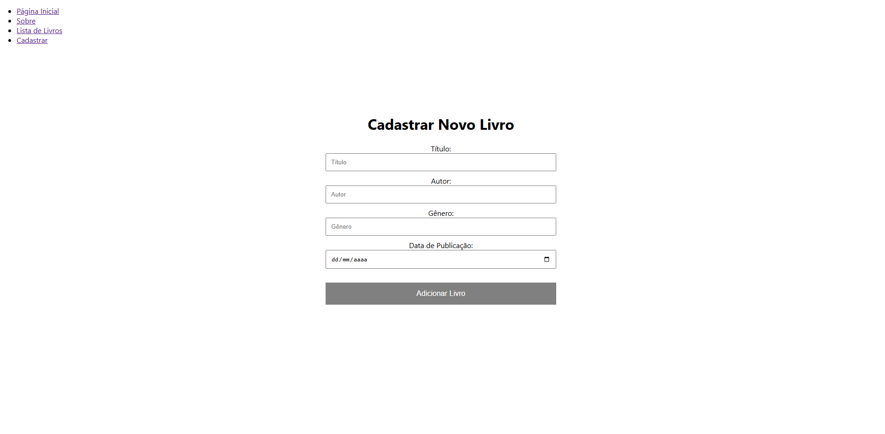
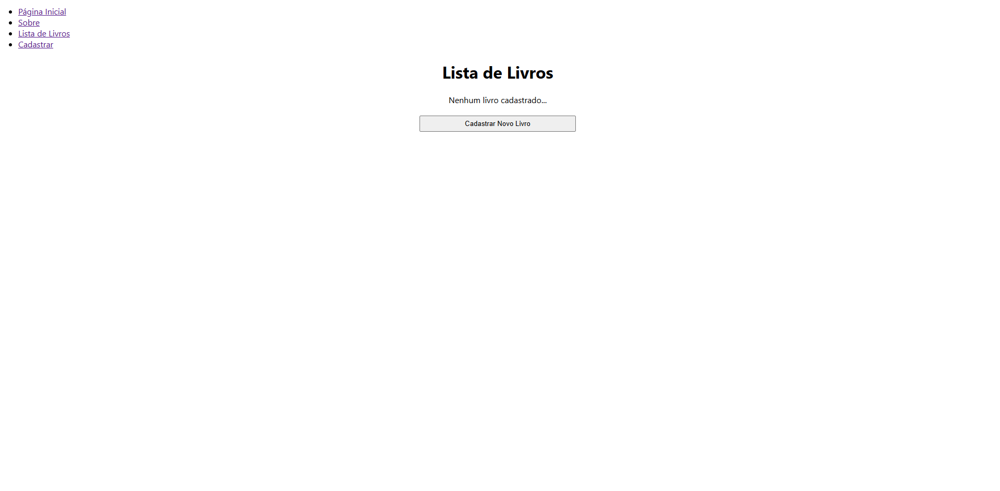

# Nome: `Nicole Saenger Soares`

## Projeto Fase 1 - CRUD para Reading Journal📚 

Este projeto é uma aplicação do tipo CRUD (Create, Read, Update, Delete) desenvolvida com React.js, como parte das atividades da disciplina de **Desenvolvimento de Sistemas Frontend** da PUCRS. O sistema permite o cadastro, visualização, edição inline e exclusão de livros de forma dinâmica e intuitiva, oferecendo uma interface responsiva e de fácil usabilidade. O foco principal do projeto é colocar em prática os conceitos fundamentais de componentização, manipulação de estado com React hooks, roteamento com React Router e estilização em CSS inline.

<br> 

---

<br>

### 🚀 Neste projeto, você encontrará as seguintes funcionalidades:

- 📌 Adicionar Livro: Insira um novo livro a listagem informando o título, autor, gênero e data de publicação do livro desejado.

- 📋 Listagem de Livros: Exibe uma lista dos livros cadastrados.

- ✏️ Editar Livro: Permite modificar as informações previamente cadastradas em relação ao livro.

- ❌ Excluir Livro: Remove o livro desejado da lista.
  
<br>

---

<br>


### 🛠️ Para o desenvolvimento do CRUD, utilizei as seguintes tecnologias:

- React.js ⚛️ – Biblioteca principal para construção da interface do usuário. O React foi utilizado para criar componentes reutilizáveis, gerenciar o estado da aplicação e renderizar dinamicamente as páginas, facilitando a navegação entre os diferentes componentes do projeto.

- JavaScript 💻 – Linguagem de programação utilizada para a lógica de funcionamento do CRUD, manipulando dados, realizando as requisições HTTP e implementando a navegação entre as páginas.

- CSS inline 🎨 – Responsável pela estilização da aplicação de uma forma simples e centralizada.

<br>

---

<br>

### 🧩 Foram desenvolvidos os seguintes componentes:
### 📤 BookForm
O componente BookForm é responsável por cadastrar novos livros no sistema. Ele exibe um formulário com campos controlados, que permitem ao usuário informar os dados de um livro (título, autor, gênero e data de publicação), e envia esses dados para a aplicação principal.

- 📌 Objetivo
  - Prover uma interface amigável e funcional para o usuário inserir novos livros na lista. Ao enviar o formulário, os dados são armazenados via a função addBook recebida por props.

- 🧠 Funcionamento
  - O estado book armazena os dados preenchidos pelo usuário. Ele é um objeto com as propriedades: title, author, genre e date.

  - A função handleSubmit é chamada ao submeter o formulário. Através dela, conseguimos prevenir o comportamento padrão de recarregamento da página, chamar a função addBook passando o objeto book e resetar o formulário para permitir o cadastro de um novo livro.

  - Cada campo do formulário é controlado por seu respectivo valor no estado book, sendo atualizado a cada digitação com o onChange.

<br> 

### 📚 BookList
O componente BookList é responsável por exibir a lista de livros cadastrados na aplicação. Ele apresenta os livros em forma de cards interativos, permitindo que o usuário visualize, edite ou exclua informações diretamente na interface.

- 🎯 Funcionalidades principais
  - Apresentar todos os livros cadastrados.

  - Permitir edição inline de cada atributo do livro (título, autor, gênero e data de publicação) diretamente nos cards.

  - Remover livros da lista.

  - Acessar o formulário de cadastro de novos livros através de um botão de navegação.

- ✏️ Edição Inline com ``EditableField``
  - Cada card de livro utiliza o componente EditableField, que permite editar campos de forma prática clicando sobre um valor exibido, ele se transforma em um campo de texto editável. Após a edição, o usuário clica em "Salvar" para atualizar o valor. O valor editado é enviado para a função editBook, que atualiza o estado da lista de livros na aplicação principal.

- 💡 Estrutura e Lógica
  - O componente recebe por props:

    - books: array de objetos representando os livros cadastrados.

    - deleteBook: função para excluir um livro.

    - editBook: função para atualizar os dados de um livro.

  - Cada livro é renderizado dentro de uma caixa estilizada com hover effect e botões de ação.

  - A exclusão de um livro é feita com um simples clique no botão "Excluir", que chama deleteBook(index).
<br> 

### 🔎 NavBar
O componente NavBar é responsável por montar a barra de navegação do sistema, permitindo a troca de páginas de forma fluida e sem recarregamento completo da aplicação (navegação SPA - Single Page Application).

- 📌 Objetivo
  - Facilitar a navegação entre as diferentes páginas da aplicação: página inicial, informações do projeto, lista de livros e formulário de cadastro.

- 🧠 Funcionamento
  - O componente importa o Link do react-router-dom, que funciona de maneira semelhante à tag de âncora, porém sem recarregar a página.

  - Dentro do JSX, é retornado um elemento nav com uma lista não ordenada que contém quatro links principais: Página Inicial (/), Sobre (/info), Lista de Livros (/list) e Cadastrar (/add).

<br>

---

<br>

### 🚀 Passo a Passo para Rodar a Aplicação Localmente 🖥️
1. Após o repositório ser clonado, navegue até a pasta do projeto utilizando o terminal:
```
cd journal
```
<br>

2. Dentro da pasta do projeto, instale as dependências necessárias utilizando o **npm**. Execute o comando:
```
npm install
```
<br>

3. Ainda dentro da pasta principal, onde estará localizada a aplicação, inicie o servidor da aplicação frontend com o comando:
```
npm start
```
<br>

A aplicação estará rodando na porta 3000 por padrão. Você pode acessar a aplicação no navegador indo para http://localhost:3000. 🌐

<br>

## 🖼️ Visualização Final
Após a execução do projeto, o resultado final no navegador será o seguinte, exibindo as 4 telas principais: 'Home', 'Sobre o Projeto', 'Listagem de Livros' e 'Cadastrar Novo Livro'. 
<br>
<br>

<br>
<br>

<br>
<br>

<br>
<br>



<br>

---

<br>
📜 Projeto autoral desenvolvido para a disciplina de Desenvolvimento de Sistemas Frontend da universidade PUCRS.
